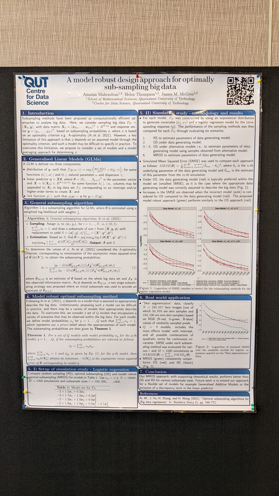

# AASC-2022
Australasian Applied Statistics Conference 2022 - Poster for the Model robust subsampling approach

Our paper [A model robust sub-sampling approach for Generalised Linear Models in Big data settings](https://arxiv.org/abs/2207.14440) was presented at the Australasian 
Applied Statistics 2022 conference as a poster. 

In this repository the latex version of the poster is available for you to read.

